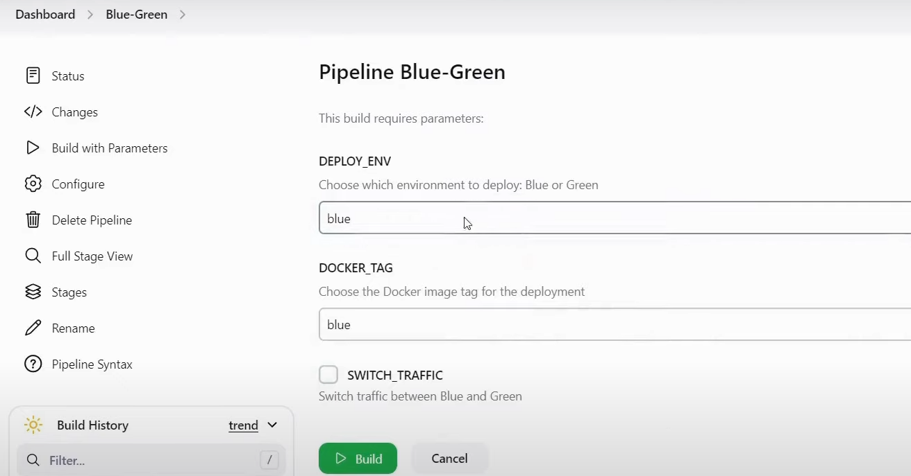
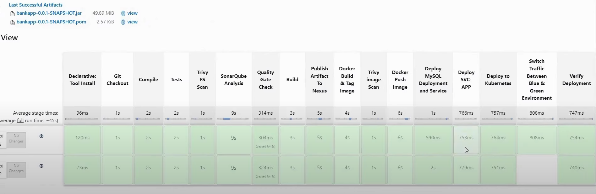

# Blue-Green Deployment Pipeline

This repository demonstrates a Continuous Integration and Continuous Deployment (CI/CD) pipeline implementing the Blue-Green deployment strategy using Jenkins, Docker, Kubernetes (EKS), and Trivy.

## Table of Contents

- [Overview](#overview)
- [Pipeline Stages](#pipeline-stages)
  - [Key Stages](#key-stages)
- [Blue-Green Deployment Strategy](#blue-green-deployment-strategy)
- [Prerequisites](#prerequisites)
- [Setup and Configuration](#setup-and-configuration)
- [Pipeline Flow](#pipeline-flow)
- [Usage](#usage)
- [Jenkins Pipeline Visuals](#jenkins-pipeline-visuals)
- [Contributing](#contributing)

## Overview

This project showcases a Jenkins pipeline that automates the build, security scanning, testing, and deployment of a Dockerized application using the Blue-Green deployment strategy. This approach ensures zero-downtime deployments by maintaining two identical environments (Blue and Green) and switching traffic between them.

## Pipeline Stages

### Key Stages

1. **Git Checkout**: Fetches the application source code from GitHub.
2. **Compile**: Compiles the application code using Maven.
3. **Tests**: Runs unit tests (can be skipped using parameters).
4. **Trivy Scans**: Conducts both File System and Docker Image security scans.
5. **SonarQube Analysis**: Performs code quality checks and enforces quality gates.
6. **Build and Publish**: Packages the application and uploads artifacts to Nexus.
7. **Docker Image Management**: Builds, tags, and pushes the Docker image to the registry.
8. **Deployment**: Deploys the application to Kubernetes, following Blue-Green principles.
9. **Traffic Switching**: Redirects traffic to the target environment (Blue or Green).
10. **Verification**: Confirms the deployment’s success.

## Blue-Green Deployment Strategy

Blue-Green deployment is a release management strategy that reduces downtime and risk by running two identical production environments, only one of which (e.g., Blue) serves live production traffic. The new version of the application is deployed to the idle environment (e.g., Green). After thorough testing, traffic is switched to the Green environment, making it live. This strategy allows for instant rollbacks if issues are detected.

## Prerequisites

1. Jenkins installed and configured on an EC2 instance.
2. Kubernetes cluster (EKS) set up and connected to Jenkins.
3. Docker installed on all necessary nodes.
4. Nexus and SonarQube instances running as Docker containers.
5. Tools and plugins installed on Jenkins:
   - Maven Integration
   - SonarQube Scanner
   - Kubernetes CLI
   - Docker Pipeline
   - Config File Provider
   - Trivy CLI

## Setup and Configuration

### Infrastructure Setup

- Launch EC2 instances for Jenkins, SonarQube, and Nexus.
- Configure security groups to allow necessary traffic.
- Install required tools (Docker, Maven, Trivy, etc.).
- Set up an EKS cluster with `aws-cli` and `terraform`.
- Configure RBAC for Jenkins to access the cluster.

### Jenkins Configuration

1. Install necessary plugins from "Manage Jenkins".
2. Add credentials for GitHub, Docker, SonarQube, and Kubernetes.
3. Configure tools like Maven and SonarQube in "Global Tool Configuration".
4. Create a pipeline job for "Blue-Green Deployment".

## Pipeline Flow

### Setup

1. **Environment Preparation**:
   - Set up an EKS cluster with Terraform.
   - Update `kubeconfig` to connect Jenkins to the cluster.
2. **Jenkins Setup**:
   - Install Jenkins and required plugins.
   - Configure credentials and tools.
3. **Third-Party Tools**:
   - Deploy Nexus and SonarQube as Docker containers.

### Pipeline

1. **Build Phase**:
   - Checkout code, compile, and run tests.
2. **Security Scans**:
   - Run Trivy scans for vulnerabilities.
3. **Code Quality**:
   - Integrate with SonarQube for static code analysis.
4. **Deployment**:
   - Deploy to Blue or Green environments.
   - Optionally switch traffic between environments.

## Usage

1. **Trigger the Pipeline**:
   - Start the Jenkins pipeline with the desired parameters (e.g., `DEPLOY_ENV`, `DOCKER_TAG`, `SWITCH_TRAFFIC`).

2. **Monitor**:
   - View the pipeline progress in Jenkins Stage View.

3. **Verify Deployment**:
   - Confirm the application is running in the target environment.

## Jenkins Pipeline Visuals

### Parameterized Build View:

### Stage View:

## Contributing

Contributions are welcome! Please fork this repository and submit a pull request for any enhancements or bug fixes.

